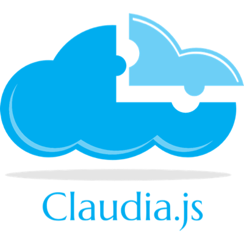

Claudia helps you deploy Node.js microservices to Amazon Web Services easily. It automates and simplifies deployment workflows and error prone tasks, so you can focus on important problems and not have to worry about AWS service quirks. [Check out this video to see how to create and deploy a microservice in under 5 minutes](https://vimeo.com/156232471).

Here are some of the things you can do with Claudia:

  * Create or update Lambda functions and Web APIs from Node.js projects hassle-free:
    * deploy using a single command (instead of [120 lines of shell scripts](https://github.com/gojko/nodejs-aws-microservice-examples/blob/master/web-parameter-processing/setup.sh))
    * automatically handle AWS service quirks such as waiting for IAM roles to propagate to Lambda
    * simplify code management and avoid inconsistencies by using a single Lambda function for all the web API operations
  * Automatically configure the Lambda function for commonly useful tasks:
     * Allow `console.log` to pipe to CloudWatch
     * Add event sources with correct IAM privileges
     * Manage different versions for production, development and testing easily 
  * Automatically set up API Gateway resources the way Javascript developers expect them to work:
     * enable CORS for all endpoints (so your users' browsers can call the APIs directly)
     * make query string, form post and request headers directly available (instead of having to specify API Gateway models and templates)
     * route errors to HTTP response code 500 (instead of the default 200 which breaks Promise-like request libraries)

Just call `claudia create` or `claudia update`, and Claudia will pack up and post-process your code, grab all the dependencies, clean up irrelevant resources, upload to Lambda, set-up web APIs, and update version aliases. 

## Examples, please!

For some nice examples, see the [Example Projects](https://github.com/claudiajs/example-projects).

## Getting started 

Please read the [getting started guide](getting_started.md) for information on setting up credentials and initialising your Lambda functions.

## Contributing

Contributions are greatly appreciated. See the [contributors' guide](contributing.md) for information on running and testing code.

## Why?

AWS Lambda and API Gateway are incredibly flexible, but they can be tedious to set up, especially for simple scenarios. The basic runtime is oriented towards executing Java code, so running Node.js functions requires you to iron out quite a few quirks, that aren't exactly well documented. Claudia is essentially a bunch of checklists and troubleshooting tips we've collected while developing microservices designed to run in AWS, automated behind a convenient API. 

### How does it compare to ...?

_Claudia is a deployment utility, not a framework._ It does not abstract away AWS services, but instead makes them easier to get started with. As opposed to [Serverless](https://github.com/serverless/serverless) and [Seneca](http://senecajs.org/), Claudia is not trying to change the way you structure or run projects. The optional [API Builder](https://github.com/claudiajs/claudia-api-builder), which simplifies web routing, is the only additional runtime dependency and it's structured to be minimal and standalone. Microservice frameworks have many nice plugins and extensions that can help kick-start standard tasks, but Claudia intentionally focuses only on deployment. One of our key design goals is not to introduce too much magic, and let people structure the code the way they want to.

_Claudia is focused on Node.js_. As opposed to [Apex](https://github.com/apex/apex) and similar deployers, Claudia has a much narrower scope. It works only for Node.js, but it does it really well. Generic frameworks support more runtimes, but leave the developers to deal with language-specific quirks. Because Claudia focuses on Node.js, it automatically installs templates to convert parameters and results into objects that Javascript can consume easily, and makes things work the way Javascript developers expect out of the box.

_Claudia helps you get simple stuff done, quickly_. As opposed to [Swagger](http://swagger.io/), Claudia has fewer features, but does simple stuff easier. Claudia doesn't require you to define APIs in separate interface files. There's no need to learn a special interface syntax, no need to keep your definition spread across multiple files and introduce the overhead of coordination and maintenance -- just [write the code](https://github.com/claudiajs/example-projects/blob/master/web-api/web.js) to handle requests. So, for example, Claudia can help you get started easily with a simple web API, but you won't be able to export it easily into iOS or Android SDKs. If you want to use a heavy interface-definition library you still can, and Claudia can deploy it, but for most of what we needed to do, that was a huge overkill. 

So, as a summary, if you want to build simple services and run them with AWS Lambda, and you're looking for something low-overhead,  easy to get started with, and you only want to use the Node.js runtime, Claudia is a good choice. If you want to export SDKs, need fine-grained control over the distribution, allocation or discovery of services, need support for different runtimes and so on, use one of the alternative tools.
